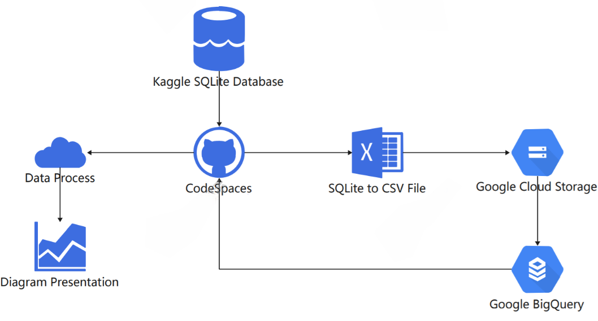

# European-Soccer

## Introduction

This project utilizes GitHub CodeSpaces, Google Cloud Storage, and Google BigQuery services to analyze the data from the [European Soccer database](https://www.kaggle.com/datasets/hugomathien/soccer), showing the transfer market trend in several seasons.

## Flow Chart

The above diagram shows the workflow of this project. 

1. Download the European Database from Kaggle to GitHub CodeSpaces using the Kaggle API. 

2. Transfer the tables that are used in this project to CSV files from the SQLite database using a bash script. 

3. Store the tables in the Google Cloud Storage (Since one of the tables is larger than 100M, which exceeds the size limit for uploading the file from the local machine)
4. Load data from Google Cloud Storage into Google BigQuery. 
5. Query the database from CodeSpaces
6. Process the data in CodeSpaces
7. Plot the Chord Diagram for the transfer market

## Usage

1. Clone the repo 

   - `git clone https://github.com/nogibjj/European-Soccer`

2. Go to the repo directory

   - `cd European-Soccer`

3. Plot the diagram

   1. Plot the diagram for the specified season
      - `./plot_selected_season.py --season <season_to_plot>`
      - The plot will be stored in the `chord_photo` directory
   2. Plot all the diagrams using the local database
      - `python plot_transfer_chord.py`
      - All the plots will be stored in the `chord_photo` directory

## Sample Output

